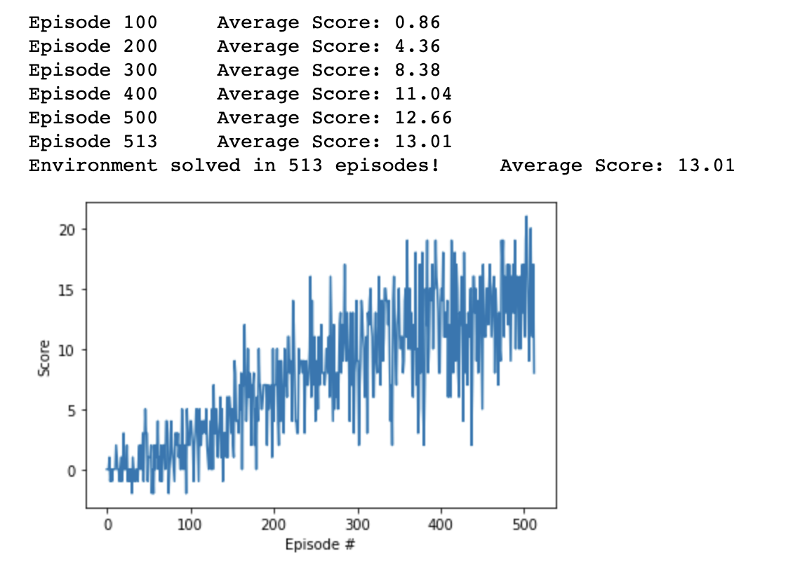

# Project Overview

### Learning Algorithm

#### Learning algorithm

The chosen algorithm for solving the project is Deep Q-Learning with the single mention that it is not using error clipping.

Tha algorithm consists of two main steps:

1. Sample: At first, the agent interacts with the environment and stores the experience tuples in agent's "Memory". Agent is choosing the action at each step based on the e-greedy policy.

2. Learn: As soon as the agent has enough experiences, he then samples a batch from its "Memory" in order to learn. 

#### Hyperparameters

We have the following hyperparameters we need to work with:
* Replay buffer size, `BUFFER_SIZE` represent the "Memory" we want our agent to have. Ideally we would like as much memory as we can get, in the current application we have 100000. It was also observed that at a certain point, with this alternative, the score graph has a significant increase in slope (if you think about a linear function that would explain it), so I decided to go with 1e6.
* Learning mini batch size, `BATCH_SIZE` is the amount of samples we will extract from "Memory" in order to learn based on. In my case it is 64. 128 was tried as an experiment, and no significant increase in performance was seen.
* The discount factor, `GAMMA` is mainly the discount that we apply on the next state and its best action pair value. We could play with this factor  in order to balance the long and short term agent objectives. Both 0.9 and 0.999 give worse results than 0.99, so the later was chosen.
* The update rate, `TAU`, one should think about this as a learning rate for weights from local network to target network. 0.005 as TAU was chosen. A higher tau gives worse results.
* The learning rate, `LR`, represents the learning rate of the networks. The actual LR is 0.0005. A smaller LR is leading to slightly worse results. Learning rate decay was also tried, but the results were not impressive.
* How often should we update our frozen network weights is given by, `UPDATE_EVERY` hyperparameter. 

#### Model architectures for NN
The most simple NN architecture was chosen consisting of two hidden layers, first one having 32 units and the 2nd 64 units respectively.
Experiments with three hidden layers and more units for the hidden layers were performed, but there was not seen an increase in performance, so I went for a simpler case that does the job.

Activation functions for layers are ReLu and RMSprop optimizer is used, same as in the original DQN paper.

### Plot of Rewards

 

The environment was solved in 513 episodes

### Ideas for Future Work
First of all, I would try error clipping and prioritized replay to see how it behaves.

